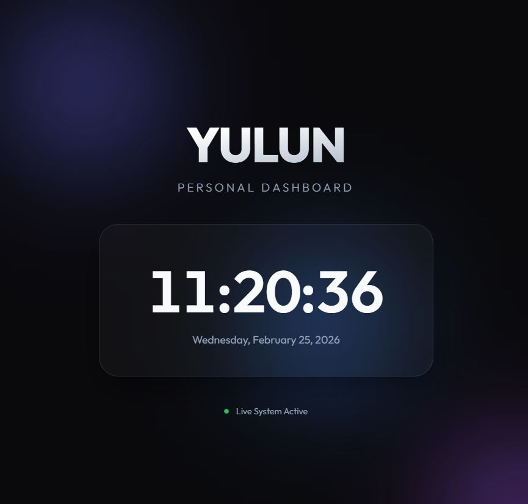

# Project Summary: YULUN Personal Dashboard
**Date:** February 25, 2026
**User:** YULUN

## 🚀 Overview
Today, I designed and developed a premium, single-page personal dashboard for **YULUN**. The project focused on high-end aesthetics, real-time interactivity, and modern web development best practices.



### 🔗 Demo
[View Live Site]((https://elaine17141.github.io/DRL_1/))

## 🛠️ Tasks Completed

### 1. Web Development & Design
- **Frontend Architecture**: Built a semantic HTML5 structure with SEO-optimized metadata.
- **Premium Styling**: Developed a "Visual Excellence" design system using:
    - **Glassmorphism**: A frosted-glass central card with backdrop-blur and 3D tilt effects.
    - **Dynamic Backgrounds**: Animated radial "aurora" blobs providing a deep, futuristic feel.
    - **Modern Typography**: Integrated the 'Outfit' font family for a sleek, professional look.
- **Interactivity**: 
    - Implemented a real-time digital clock and date display using JavaScript.
    - Added a 3D parallax effect on the central card that responds to mouse movement.
    - Added a live status indicator with a CSS-pulse animation.

### 2. Quality Assurance
- **Browser Verification**: Used a browser subagent to preview the page.
- **Verification Results**: Confirmed real-time clock accuracy, visual fidelity of animations, and perfect font rendering.

### 3. Version Control & Deployment
- **Git Initialization**: Set up a local repository in the project directory.
- **Repository Setup**: Created the initial commit with all source files.
- **GitHub Integration**: Linked the project to the remote repository `https://github.com/Elaine17141/DRL_1.git`.
- **Deployment**: Pushed the `main` branch to GitHub, making the code live and accessible.

## 📂 File Structure
```text
C:\USERS\YULUN\DOWNLOADS\TEST\
├── index.html      # Main page structure
├── style.css       # Design tokens and animations
├── script.js      # Clock logic and 3D effects
└── SUMMARY.md      # This project documentation
```

## 🔗 Repository
[https://github.com/Elaine17141/DRL_1](https://github.com/Elaine17141/DRL_1)
